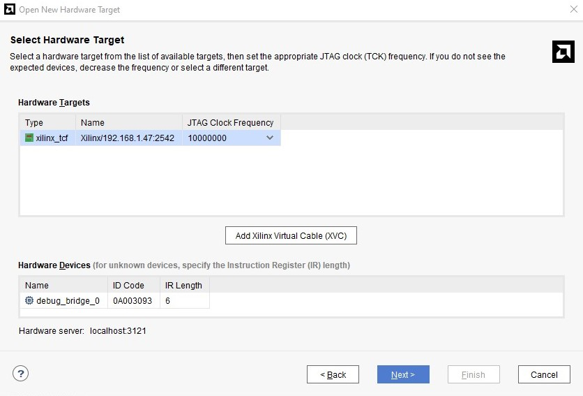

# PetaLinux Flexible NFS Root with XVC

1. [Introduction](#introduction)
2. [Prerequisites](#prerequisites)
    * [TFTP Server](#tftp-server)
        * [Install TFTP Server](#install-tftp-server)
        * [Create TFTP Root Directory](#create-tftp-root-directory)
            * [Change the TFTP Server Directory’s Permissions](#change-the-tftp-server-directorys-permissions)
        * [Configure TFTP Server](#configure-tftp-server)
        * [Restart TFTP Server](#restart-tftp-server)
        * [Verify TFTP Server](#verify-tftp-server)
        * [Start TFTP Server](#start-tftp-server)
        * [Start TFTP Server on Boot](#start-tftp-server-on-boot)
    * [NFS Server](#nfs-server)
        * [Install NFS Server](#install-nfs-server)
        * [Create NFS Root Directory](#create-nfs-root-directory)
            * [Set Permissions](#set-permissions)
        * [Export NFS Root (***important***)](#export-nfs-root-important)
        * [Restart NFS Server](#restart-nfs-server)
        * [Add rules to the firewall](#add-rules-to-the-firewall)
            * [Enable the firewall](#enable-the-firewall)
            * [Firewall status](#firewall-status)
        * [Verify NFS Server](#verify-nfs-server)
    * [NFS Client](#nfs-client)
        * [Install NFS Client](#install-nfs-client)
        * [Create NFS Mount Point](#create-nfs-mount-point)
        * [Mount NFS Share](#mount-nfs-share)        
    * [Prepare the Hardware](#prepare-the-hardware)
        * [Block Design Example](#block-design-example)
        * [Debug Bridge Configuration](#debug-bridge-configuration)
        * [System ILA Configuration](#system-ila-configuration)
3. [PetaLinux Project](#petalinux-project)
    * [Requirements](#requirements)
    * [Create a PetaLinux Project](#create-a-petalinux-project)
        * [Device Tree Configuration](#device-tree-configuration)
    * [PetaLinux Configuration](#petalinux-configuration)
        * [Root File System Configuration](#root-file-system-configuration)
        * [Kernel configuration](#kernel-configuration)
    * [Create Kernel Module](#create-kernel-module)
        * [Setup XVC Driver](#setup-xvc-driver)
    * [Create Application](#create-application)
        * [Setup XVC Server](#setup-xvc-server)
        * [Setup RPT Server (optional)](#setup-rpt-server-optional)
4. [Prepare SD Card](#prepare-sd-card)
5. [Prepare NFS Root](#prepare-nfs-root)
6. [The First Boot](#the-first-boot)
    * [U-Boot CLI](#u-boot-cli)
        * [Setup Environment Variables](#setup-environment-variables)
7. [Starting the Software](#starting-the-software)
    * [Start XVC Driver](#start-xvc-driver)
    * [Start XVC Server](#start-xvc-server)
    * [Start RPT Server (optional)](#start-rpt-server-optional)

8. [Hardware Manager](#hardware-manager)
    * [Hardware Targets](#hardware-targets)
    * [Hardware ILA](#hardware-ila)    

## Introduction
**Overview of the Project: Configuring PetaLinux with NFS Root File System and XVC**

Embedded systems landscape, the seamless integration of hardware and software components is vital for efficient development and deployment. This project aims to streamline the process by configuring a PetaLinux system with an NFS (Network File System) root file system and integrating XVC (Xilinx Virtual Cable) for remote debugging capabilities. Below is an overview of the project's key components and objectives:

**NFS Root File System:**

* Purpose: NFS serves as a distributed file system protocol, enabling network-based access to files and directories.
* Objective: To set up a PetaLinux system with NFS as the root file system, providing centralized storage and simplified maintenance.
* Benefits: Centralized management, easy updates, and the ability to boot embedded devices directly from a network-shared file system.

**XVC (Xilinx Virtual Cable):**

* Purpose: XVC facilitates remote debugging and monitoring of FPGA or SoC devices without the need for physical JTAG cables.
* Objective: Integration of XVC into the PetaLinux project to enable remote debugging capabilities.
* Benefits: Flexible debugging workflows, real-time monitoring of internal signals, and enhanced efficiency in hardware-software co-design.

**Project Setup Steps:**

* TFTP and NFS Server Configuration: Installation and configuration of TFTP and NFS servers to facilitate file sharing and system booting.
* NFS Root File System Preparation: Creation of a robust NFS root file system with proper permissions and configurations for seamless access.
* XVC Integration: Incorporation of XVC driver and server components into the PetaLinux project for remote debugging purposes.
* Hardware Configuration: Setup of debug bridges and ILA cores within the hardware design for real-time monitoring and debugging capabilities.

**Objectives:**

* Establishing a comprehensive development environment conducive to efficient hardware-software co-design and debugging processes.
* Enabling remote debugging capabilities through the integration of XVC, enhancing flexibility and scalability in the development workflow.
* Streamlining file system management and access by configuring NFS as the root file system, promoting centralized storage and simplified maintenance.

**Conclusion:**

* By following the outlined steps and configurations, can create a robust PetaLinux environment with NFS as the root file system and integrated XVC for remote debugging. This setup empowers with enhanced flexibility, scalability, and efficiency in designing and debugging FPGA or SoC-based applications, ultimately accelerating the development cycle and improving overall productivity.

## Prerequisites
### TFTP Server
TFTP (Trivial File Transfer Protocol) is a simple protocol used for transferring files over a network. A TFTP server is a program or service that implements the TFTP protocol, allowing devices to upload or download files to or from it.

#### Install TFTP Server
To install the TFTP server, run the following commands:
```bash
sudo apt update
sudo apt install tftpd-hpa
```

#### Create TFTP Root Directory
Create a directory for the TFTP server with the following command:
```bash
sudo mkdir /tftpboot
```

#### Change the TFTP Server Directory’s Permissions
Change the directory’s permissions with the following commands:
```bash
sudo chown nobody:nogroup /tftpboot
sudo chmod 777 /tftpboot
```

#### Configure TFTP Server
Edit the TFTP server configuration file with the following command:
```bash
sudo nano /etc/default/tftpd-hpa
```
If necessary, change the following lines:
```bash
TFTP_USERNAME="tftp"
TFTP_DIRECTORY="/tftpboot"
TFTP_ADDRESS="0.0.0.0:69"
TFTP_OPTIONS="--secure"
```

#### Restart TFTP Server
After changing the configuration file, restart the TFTP server with the following command:
```bash
sudo systemctl restart tftpd-hpa
```

#### Verify TFTP Server
To verify that the TFTP server is running, run the following command:
```bash
sudo systemctl status tftpd-hpa
```

#### Start TFTP Server
If the TFTP server is not running, start it with the following command:
```bash
sudo systemctl start tftpd-hpa
```

#### Start TFTP Server on Boot
To start the TFTP server on boot, run the following command:
```bash
sudo systemctl enable tftpd-hpa
```

### NFS Server
Network File System (NFS) is a distributed file system protocol allowing a user on a client computer to access files over a network in a manner similar to how local storage is accessed. An NFS server is a system that hosts shared directories, making them available to clients on the network.

#### Install NFS Server
To install the NFS server, run the following command:
```bash
sudo apt update
sudo apt install nfs-kernel-server
```

#### Create NFS Root Directory
Create a directory for the NFS server with the following command:
```bash
sudo mkdir /tftpboot/nfsroot
```

#### Set Permissions
Change the directory’s permissions with the following commands:
```bash
sudo chown nobody:nogroup /tftpboot/nfsroot
sudo chmod 777 /tftpboot/nfsroot
```

#### Export NFS Root (***important***)
Edit the NFS server configuration file with the following command:
```bash
sudo nano /etc/exports
```
Add the following line(s) to the configuration file:
```bash
/tftpboot/nfsroot 192.168.1.0/24(rw,sync,no_subtree_check,no_root_squash)
```
* **/tftpboot/nfsroot** - The directory to export
* **192.168.1.0/24** - The IP address range that can access the NFS share
* **rw** - Read/Write access
* **sync** - Synchronous writes
* **no_subtree_check** - Disable subtree checking
* **no_root_squash** - Disable root squashing

Save the file and exit (Ctrl + s, Ctrl + x) the editor. After changing the configuration file, make the export with the following command:
```bash
sudo exportfs -a
```

#### Restart NFS Server
After changing the configuration file, restart the NFS server with the following command:
```bash
sudo systemctl restart nfs-kernel-server
```

#### Add rules to the firewall
To add rules to the firewall, run the following commands:
```bash
sudo ufw allow from 192.168.1.0/24 to any port nfs
```

#### Enable the firewall
To enable the firewall, run the following command:
```bash
sudo ufw enable
```

#### Firewall status
To check the firewall status, run the following command:
```bash
sudo ufw status
```

#### Verify NFS Server
To verify that the NFS server is running, run the following command:
```bash
sudo systemctl status nfs-kernel-server
sudo showmount -e
```

### NFS Client
To access files shared by an NFS server from a client machine, you need to set up the NFS client software and mount the shared directories.

#### Install NFS Client
To install the NFS client, run the following command:
```bash
sudo apt update
sudo apt install nfs-common
```

#### Create NFS Mount Point
Create a directory for the NFS mount point with the following command:
```bash
sudo mkdir ~/nfsroot_client
```

#### Mount NFS Share
To mount the NFS share, run the following command:
```bash
sudo mount <NFS_Server_IP>:/tftpboot/nfsroot ~/nfsroot_client
```

### Prepare the Hardware
Add to your hardware design the following IP cores:
* **Debug Bridge**
* **System ILA**
#### Block Design Example


#### Debug Bridge Configuration
For this project, the Debug Bridge type is configured as AXI to BSCAN. This bridge type is intended for designs that use Xilinx Virtual Cable (XVC) to remotely debug on FPGA or SoC device through Ethernet or other interfaces without the need for JTAG cable. In this mode, the Debug Bridge receives XVC Commands via AXI4-Lite interface.    


#### System ILA Configuration
Configure the System ILA to capture the interfaces of interest. For this project, the System ILA is configured to capture the following interfaces (see example of block design above):

## PetaLinux Project
### Requirements
* [PetaLinux Tools Documentation: Reference Guide (UG1144)
](https://docs.amd.com/r/en-US/ug1144-petalinux-tools-reference-guide)
* [Ubuntu 22.04.2 LTS (virtual machine is preferred)](https://old-releases.ubuntu.com/releases/20.04.2/)
* [PetaLinux Tools 2023.2 (installed according to the documentation)](https://www.xilinx.com/support/download/index.html/content/xilinx/en/downloadNav/embedded-design-tools.html)

### Create a PetaLinux Project
An empty project is created with the following command:
```bash
petalinux-create --type project --template zynqMP --name <project name>
cd <project name>
```

#### Device Tree Configuration
Add the following lines to the device tree file:
```dts
/include/ "system-conf.dtsi"
/ {
    chosen {
        bootargs = "console=ttyPS0,115200 root=/dev/nfs nfsroot=<NFS Server IP>:/tftpboot/nfsroot/plnx_rootfs,tcp,nfsvers=4 ip=dhcp rw";
    }:
};

&sdhci0 {
       no-1-8-v;
       disable-wp;
};

&sdhci1 {
       no-1-8-v;
       disable-wp;
};

&debug_bridge_0 {
        compatible = "xlnx,xvc";
};
```
* **NFS Server IP** - Change this to the IP address of the NFS server
* **debug_bridge_0** - Compatibility string for the device driver

### PetaLinux Configuration
After creating the project, configure the PetaLinux project with the following command:
```bash
petalinux-config --get-hw-description ~/<file name>.xsa
```
After the XSA file has been imported successfully, the PetaLinux system configuration is opened. The following settings are changed:
```text
→ Subsystem AUTO Hardware Settings  --->
	Ethernet Settings  --->
		[*] Randomise MAC address

→ FPGA Manager --->
	[*] Fpga Manager
	
→ Image Packaging Configuration --->
	Root filesystem type (NFS) --->
		(X) NFS
	(/tftpboot/nfsroot) Location of NFS root directory --->
		/tftpboot/nfsroot
	[*] Copy final images to tftpboot
	(/tftpboot) tftpboot directory --->
	    /tftpboot	
```

#### Root File System Configuration
At this stage, any packages, such as GCC, Python etc., or user packages like xvcserver, rptserver, can be added to the project if necessary.

To configure the root file system, run the following command:
```bash
petalinux-config -c rootfs
```

#### Kernel configuration
Check kernel Configuration in accordance with PetaLinux Tools Documentation: Reference Guide (UG1144) "Configuring NFS Boot" section. 

Use the following command to open the kernel configuration:
```bash
petalinux-config -c kernel
```

### Create Kernel Module
#### Setup XVC Driver
Create a kernel module for the XVC driver with the following command:
* **Avoid using capital letters and underscore '_' when creating module name**
```bash
petalinux-create -t modules --name xvc-driver --enable
```
Copy following files: **xvc_driver_base.c**, **xvc_driver.c**, **xvc_driver.h**, **xvc_ioctl.h**, **xvc_user_config.h** into recipe to build the kernel module in the **project-spec/meta-user/recipes-modules/xvc-driver/files** directory. Files can be found in the [XVC_ZynqMP/xvc-driver](XVC_ZynqMP/xvc-driver/files) directory or copy and replace entire **xvc-driver** folder.

Change the SRC_URI BitBake variable in the **project-spec/meta-user/recipes-modules/xvc-driver/xvc-driver.bb** recipe file to:
```BitBake
SRC_URI = "file://Makefile \
           file://COPYING \
           file://xvc_driver_base.c \
           file://xvc_driver.c \
           file://xvc_driver.h \
           file://xvc_ioctl.h \
           file://xvc_user_config.h \
          "
```
Change the first two lines of the Makefile in the directory **project-spec/meta-user/recipes-modules/xvc-driver/files** to:
```Makefile
obj-m := xvc-driver.o
xvc-driver-objs := xvc_driver.o xvc_driver_base.o
```
Add the following line to the **xvc_driver.h** file (in folder [XVC_ZynqMP/xvc-driver](XVC_ZynqMP/xvc-driver/files) all files already modified):
```C
#define LOG_PREFIX
```
Before building the module, configure the root file system with the following command:
```bash
    petalinux-config -c rootfs
```
Check if the module is enabled in the configuration in:
```bash
    user packages ---> 
        [*] xvc-driver
```
To compile and install module run following commands:
```bash
    petalinux-build -c kernel
    petalinux-build -c xvc-driver
```
Also need to rebuild PetaLinux bootable images run this command:
```bash
    petalinux-build -c rootfs
```

### Create Application
#### Setup XVC Server
* **Avoid using capital letters and underscore '_' when creating application name**
Create XVC server application with the following command:
```bash
petalinux-create -t apps --name xvcserver --enable
```
Copy the following files: **xvcserver.c**, **xvc_ioctl.h** and **Makefile** into the recipe to build the XVC server application in the **project-spec/meta-user/recipes-apps/xvcserver/files** directory. Files can be found in the [XVC_ZynqMP/xvcserver](XVC_ZynqMP/xvcserver/files) directory or copy and replace entire **xvcserver** folder.

Change the SRC_URI BitBake variable in the **project-spec/meta-user/recipes-apps/xvcserver/xvcserver.bb** recipe file (in folder [XVC_ZynqMP/xvcserver](XVC_ZynqMP/xvcserver/files) all files already modified) to:
```BitBake
SRC_URI = "file://xvcserver.c \
           file://xvc_ioctl.h \
	       file://Makefile \
          "
```
also add the following lines:
```BitBake
DEPENDS = "\
    xvc-driver \
    "
```
Check if the xvcserver application is enabled in the configuration in:
```bash
    user packages ---> 
        [*] xvcserver
```
To build xvcserver application, run the following command:
```bash
petalinux-build -c xvcserver
```

#### Setup RPT Server (optional)
Create RPT server application with the following command:
```bash
petalinux-create -t apps --name rptserver --enable
```
Copy the following files: **rptserver.c**, **gpio.c**, **mmio.c**, **mmio.h** and **Makefile** into the recipe to build the RPT server application in the **project-spec/meta-user/recipes-apps/rptserver/files** directory. Files can be found in the [XVC_ZynqMP/rptserver](XVC_ZynqMP/rptserver/files) directory or copy and replace entire **rptserver** folder.

Change the SRC_URI BitBake variable in the **project-spec/meta-user/recipes-apps/rptserver/rptserver.bb** recipe file (in folder [XVC_ZynqMP/rptserver](XVC_ZynqMP/rptserver/files) all files already modified) to:
```BitBake
SRC_URI = "file://Makefile \
	       file://rptserver.c \
	       file://gpio.c \
	       file://mmio.c \
	       file://mmio.h \
	      "
```
Check if the rptserver application is enabled in the configuration in:
```bash
user packages ---> 
    [*] rptserver
```
To build rptserver application, run the following command:
```bash
petalinux-build -c rptserver
```
Also, it is necessary to rebuild PetaLinux bootable images. To do this, run the following:
```bash
petalinux-build -c rootfs
```

Then, build the PetaLinux project with the following command:
```bash
petalinux-build
```
#### Packaging a Petalinux Project
After the project is built, the project is packaged with the following command:
```bash
petalinux-package --boot --format BIN --fsbl images/linux/zynqmp_fsbl.elf --u-boot images/linux/u-boot.elf --pmufw images/linux/pmufw.elf --fpga images/linux/system.bit --force
```
After the project has been built and packaged successfully, all files will be located in the **<Project_Name>/images/linux** directory. Also, all files will be copied to **/tftpboot** directory.

## Prepare SD Card
Format SD card with FAT32 file system and copy from **<Project_Name>/images/linux** directory to the root of the SD card follow files:
* **BOOT.BIN**
* **boot.scr**
* **image.ub**

## Prepare NFS Root
With **NFS** Root File System Type it is possible to use several Root File Systems that can be selected in the bootloading process. ***See The First Boot***.

For example, to use a **PetaLinux** root file system created for this project with **XVC (Xilinx Virtual Cable)**, follow the steps below:

* Create a directory for the root file system with the following command:
    ```bash
    sudo mkdir /tftpboot/nfsroot/plnx_rootfs
    ```
* Extract the root file system with the following command:
    ```bash
    sudo tar -xvf <Project_Name>/images/linux/rootfs.tar.gz -C /tftpboot/nfsroot/plnx_rootfs
    ```

Or **"ArchLinuxARM aarch64"** root file system can be used with the following steps:

* Download the latest Arch Linux ARM to the home directory:
    ```bash
    wget http://os.archlinuxarm.org/os/ArchLinuxARM-aarch64-latest.tar.gz
    ```
* Create a directory for the root file system with the following command:
    ```bash
    sudo mkdir /tftpboot/nfsroot/arch_rootfs
    ```
* Extract the root file system with the following command:
    ```bash
    sudo tar -xvf ArchLinuxARM-aarch64-latest.tar.gz -C /tftpboot/nfsroot/arch_rootfs
    ```

## The First Boot
After the SD card is prepared and the NFS root is set up, insert the SD card into the board and power it on. The board will boot from the SD card and load the root file system from the NFS server.

Also, if during the boot process hit any key to stop autoboot, the U-Boot command line interface (CLI) will be displayed on the terminal. The U-Boot CLI can be used to set up the environment variables for the NFS boot.

### U-Boot CLI
U-Boot CLI can be used to set up the environment variables for the NFS boot. To help using the U-Boot CLI, the following commands can be used:
```
help
```

#### Setup Environment Variables
To set up the environment variables for the PetaLinux root file system, use the following commands:
```
setenv bootargs console=ttyPS0,115200 root=/dev/nfs nfsroot=192.168.1.39:/tftpboot/nfsroot/plnx-rootfs,tcp,nfsvers=4 ip=dhcp rw
```
Or set up the environment variables for the Arch Linux ARM root file system:
```
setenv bootargs console=ttyPS0,115200 root=/dev/nfs nfsroot=192.168.1.39:/tftpboot/nfsroot/alarm-rootfs,tcp,nfsvers=4 ip=dhcp rw
```
Save the environment variables with the following command:
```
saveenv
```
To verify that the environment variables has been set, use the following command:
```
printenv
```
After saving the environment variables, boot the device with the following command:
```
boot
```
Or reset the device with the following command:
```
reset
```
If it is necessary to load a different root file system, reboot the device and hit any key to stop autoboot. Then, use the following commands to set up the environment variables for the Arch Linux ARM root file system:
```bash
setenv bootargs console=ttyPS0,115200 root=/dev/nfs nfsroot=<NFS_Server_IP>:<Path_to_RootFS>,tcp,nfsvers=4 ip=dhcp rw
```

## Starting the Software
### Start XVC Driver
Use the following command to start the XVC driver:
```bash
sudo modprobe xvc-driver
```

### Start XVC Server
Use the following command to start the XVC server:
```bash
sudo xvcserver &
```

### Start RPT Server (optional)
Use the following command to start the RPT server:
```bash
sudo rptserver
```

## Hardware Manager
### Hardware Targets
The Hardware Manager is used to manage the hardware targets in the Vivado Design Suite. The Hardware Manager allows you to program and debug the hardware design on the FPGA device.
Open Hardware Manager --> Open Target --> Open Hardware Target --> Hardware Server Settings --> Connect to: Local Server --> Select Hardware Target --> Add Xilinx Virtual Cable (XVC) --> Host name: <NFS_Server_IP> --> Port: 2542 --> OK --> Finish

### Hardware ILA
The Hardware Integrated Logic Analyzer (ILA) is a debug core that allows you to monitor internal signals in design in real-time. The ILA core is used to capture signals in the design and display them in the Vivado Logic Analyzer. Configure the ILA according to the block design example.


